# Mermaid Diagram Standards & Best Practices

Generate professional, well-structured diagrams using Mermaid's text-based syntax. Apply when creating documentation, visualizing system architecture, workflows, or data relationships.

## Diagram Classification System

```
DIAGRAM_TYPE := FLOWCHART | SEQUENCE | GANTT | CLASS | STATE | ENTITY_RELATIONSHIP | USER_JOURNEY | GITGRAPH | MINDMAP | TIMELINE | SANKEY | QUADRANT
COMPLEXITY := SIMPLE | MODERATE | COMPLEX
PURPOSE := DOCUMENTATION | ARCHITECTURE | PROCESS | ANALYSIS | PRESENTATION
AUDIENCE := TECHNICAL | BUSINESS | MIXED
```

## Core Principles

### 1. Clarity & Readability
- **Descriptive labels**: Use clear, concise node labels that explain purpose
- **Logical flow**: Arrange elements in intuitive reading order (top-to-bottom, left-to-right)
- **Consistent styling**: Apply uniform formatting within each diagram type
- **Appropriate complexity**: Keep diagrams focused on single concepts

### 2. Syntax Precision
- **Valid identifiers**: Use alphanumeric characters, underscores for node IDs
- **Proper escaping**: Escape special characters in labels using quotes
- **Consistent indentation**: Use 2-4 spaces for nested elements
- **Semantic naming**: Choose ID names that reflect actual meaning

### 3. Maintainability
- **Modular design**: Break complex diagrams into smaller, focused components
- **Version-friendly**: Structure for easy diff viewing in version control
- **Comment usage**: Add comments to explain complex logic or assumptions

## Diagram Type Templates

### Flowchart - Process & Decision Flow
**Use for**: Process documentation, decision trees, system workflows

**Structure Pattern**:


**Node Types**:
- `[]` Rectangle (process/action)
- `()` Rounded rectangle (start/end)
- `{}` Diamond (decision)
- `/\` Parallelogram (input/output)
- `[()]` Stadium (subprocess)

### Sequence Diagram - Interaction Flow
**Use for**: API interactions, user workflows, system communication

**Structure Pattern**:


```mermaid
sequenceDiagram
    participant User as 👤 User
    participant App as 🖥️ Application
    participant API as 🔗 API Server
    participant DB as 🗄️ Database
    
    User->>+App: Submit Request
    App->>+API: Validate & Process
    API->>+DB: Query Data
    DB-->>-API: Return Results
    API-->>-App: Formatted Response
    App-->>-User: Display Results
    
    Note over User,DB: Authentication handled by API middleware
    
    alt Success Path
        API->>App: 200 OK
    else Error Path
        API->>App: 4xx/5xx Error
        App->>User: Error Message
    end
```

**Best Practices**:
- Use `+`/`-` for activation/deactivation
- Add meaningful participant aliases
- Include alt/opt/loop for complex flows
- Use notes for important context

### Class Diagram - Structure & Relationships
**Use for**: Software architecture, data models, system design

**Structure Pattern**:
```mermaid
classDiagram
    class User {
        +int id
        +string email
        +string name
        +validateEmail() bool
        +updateProfile() void
    }
    
    class Order {
        +int orderId
        +datetime createdAt
        +decimal total
        +calculateTotal() decimal
        +addItem(item: Item) void
    }
    
    class Item {
        +int itemId
        +string name
        +decimal price
        +int quantity
    }
    
    User ||--o{ Order : places
    Order ||--o{ Item : contains
    
    note for User "Handles user authentication\nand profile management"
```

### State Diagram - Status & Transitions
**Use for**: State machines, workflow states, system status

**Structure Pattern**:


## Decision Framework

### Diagram Type Selection
```
IF showing_process_flow THEN flowchart
ELSE IF showing_interactions THEN sequence
ELSE IF showing_data_structure THEN class
ELSE IF showing_state_changes THEN state
ELSE IF showing_project_timeline THEN gantt
ELSE IF showing_relationships THEN entity_relationship
```

### Complexity Management
- **Simple** (≤10 nodes): Single diagram, minimal styling
- **Moderate** (11-25 nodes): Multiple sections, basic styling
- **Complex** (>25 nodes): Break into multiple diagrams, extensive styling

### Layout Optimization
```
LAYOUT_DIRECTION := TD | TB | BT | RL | LR
CHOOSE_BY := 
  - Content flow (TD for processes, LR for timelines)
  - Space constraints (LR for wide screens, TD for mobile)
  - Readability (minimize crossing lines)
```

## Quality Validation Checklist

### Syntax Validation
- [ ] **Valid Mermaid syntax**: No syntax errors when rendered
- [ ] **Proper node IDs**: Alphanumeric characters, meaningful names
- [ ] **Correct relationships**: Valid arrow types and directions
- [ ] **Escaped special characters**: Quotes around labels with special chars

### Design Quality
- [ ] **Clear purpose**: Diagram serves specific documentation goal
- [ ] **Appropriate complexity**: Not overwhelming, focused scope
- [ ] **Logical flow**: Natural reading order, minimal line crossings
- [ ] **Consistent styling**: Uniform colors, fonts, and spacing

### Content Quality
- [ ] **Descriptive labels**: Clear, concise, meaningful text
- [ ] **Complete coverage**: All relevant elements included
- [ ] **Accurate relationships**: Connections reflect actual relationships
- [ ] **Contextual notes**: Explanations for complex parts

## Common Patterns & Anti-Patterns

### ✅ Best Practices


### ❌ Anti-Patterns to Avoid
- **Too many nodes**: >30 nodes in single diagram
- **Unclear labels**: "Process 1", "Step A", generic names
- **Missing relationships**: Disconnected nodes without clear flow
- **Inconsistent styling**: Mixed colors/styles without semantic meaning
- **Poor layout**: Excessive crossing lines, illogical flow

## Styling Guidelines

### Color Scheme (Semantic)
```mermaid
%%{init: {
  'theme': 'base',
  'themeVariables': {
    'primaryColor': '#ff6b6b',
    'primaryTextColor': '#fff',
    'primaryBorderColor': '#ff4757',
    'lineColor': '#5f6368',
    'secondaryColor': '#32a852',
    'tertiaryColor': '#ffa726'
  }
}}%%
```

### Class Definitions
```
classDef success fill:#d4edda,stroke:#155724,color:#155724
classDef error fill:#f8d7da,stroke:#721c24,color:#721c24
classDef warning fill:#fff3cd,stroke:#856404,color:#856404
classDef process fill:#e3f2fd,stroke:#1565c0,color:#1565c0
```

## Advanced Techniques

### Subgraphs for Organization


### Interactive Elements


### Dynamic Styling


## Integration Best Practices

### Documentation Integration
- Place diagrams near related text content
- Use descriptive titles and captions
- Provide context for complex diagrams
- Keep diagrams up-to-date with code changes

### Version Control
- Use meaningful commit messages for diagram changes
- Consider diagram-specific branches for major revisions
- Include diagram source in code reviews
- Maintain diagram changelog for significant updates

### Accessibility
- Use high contrast colors
- Provide alternative text descriptions
- Ensure diagrams work at different zoom levels
- Consider colorblind-friendly palettes

## Quality Assurance Commands

### Validation Scripts
```bash
# Mermaid CLI validation
mermaid -i diagram.mmd -o output.png

# Batch validation
find . -name "*.mmd" -exec mermaid -i {} \;

# Integration with CI/CD
mermaid --validate docs/**/*.mmd
```

### Testing Checklist
- [ ] Renders correctly in target environments
- [ ] Maintains readability at different sizes
- [ ] Works with project's theme/branding
- [ ] Accessible to users with disabilities

## References & Resources

- **Official Documentation**: https://mermaid.js.org/
- **Live Editor**: https://mermaid.live/
- **Syntax Guide**: https://mermaid.js.org/intro/syntax-reference.html
- **Community Examples**: https://github.com/mermaid-js/mermaid/tree/develop/docs

---

**Integration Notes**: 
- Works with @cursor-rules.mdc meta-framework
- Follows @git-commit-message.mdc for version control
- Aligns with project documentation standards
- Supports @GenerativeAI development acceleration goals
