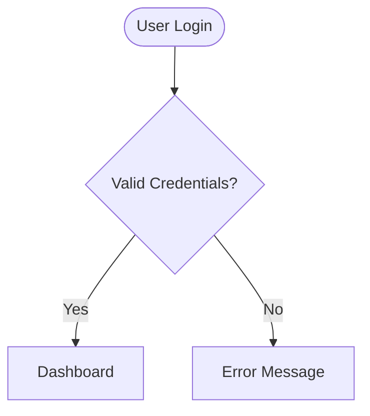
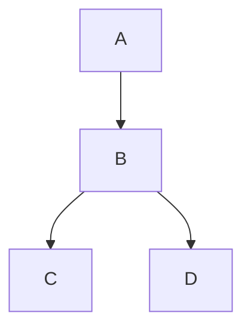
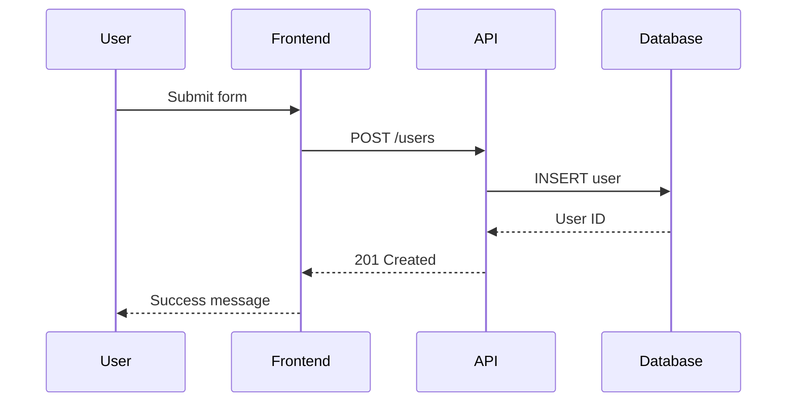
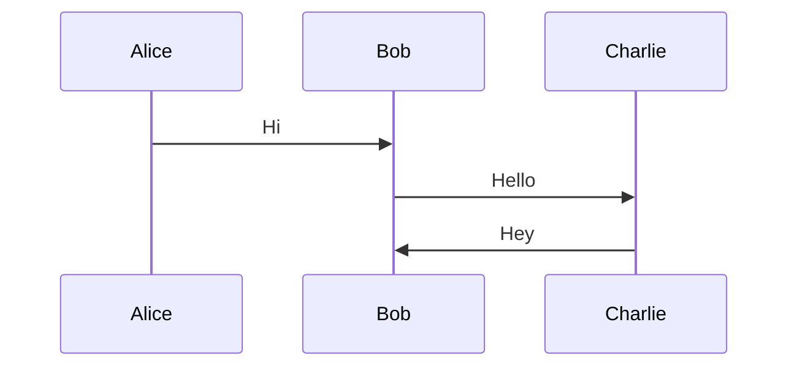
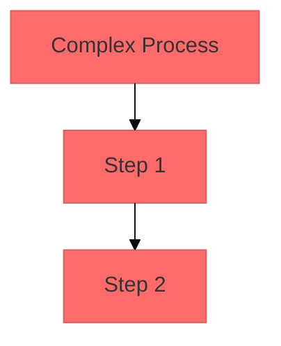
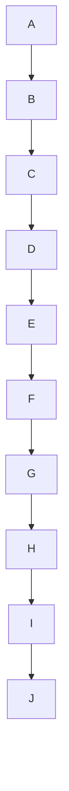
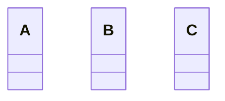

# Mermaid.js

Mermaid.js is a JavaScript-based diagramming tool that creates diagrams from
text using markdown-inspired syntax. It solves the "Doc-Rot" problem by making
diagrams easy to create, maintain, and version control.

## Key Takeaways

- **Text-based diagrams**: Write diagrams as code using simple, readable syntax
- **Version controllable**: Diagrams live in your codebase and evolve with it
- **Multiple diagram types**: Supports 14+ diagram types from flowcharts to
  architecture
- **GitHub native**: Renders automatically in GitHub markdown files since 2022
- **Maintenance friendly**: Easy to update and modify compared to visual tools
- **AI agent friendly**: Perfect for programmatic diagram generation and
  documentation

## Concepts

### Core Philosophy

Mermaid addresses documentation lag in software development. Traditional
diagramming tools create images that become outdated quickly and require
specialized software to modify. Mermaid treats diagrams as code - they're
written in text, stored in version control, and can be updated by anyone on the
team.

### Syntax Structure

All Mermaid diagrams follow the same pattern:

1. **Diagram type declaration** - Tells Mermaid what kind of diagram to render
2. **Content definitions** - The actual diagram elements and relationships
3. **Optional configuration** - Styling, themes, and behavior customization

### Diagram Categories

**Process and Flow Diagrams**:

- Flowcharts for decision trees and processes
- Sequence diagrams for system interactions
- State diagrams for state machines
- User journey diagrams for experience flows

**Technical Documentation**:

- Class diagrams for object relationships
- Entity relationship diagrams for databases
- C4 diagrams for software architecture
- GitGraph for version control workflows

**Project Management**:

- Gantt charts for project timelines
- Requirement diagrams for system specifications
- Quadrant charts for 2x2 analysis

**Data Visualization**:

- Pie charts for proportional data
- Timeline diagrams for chronological events
- Mindmaps for hierarchical information

### Rendering and Integration

Mermaid works in multiple environments:

- **Web browsers** via JavaScript library
- **GitHub/GitLab** with native markdown support
- **Command line** using mermaid-cli for file generation
- **Documentation sites** like GitBook, Notion, and Confluence

## Rules

### Syntax Fundamentals

1. **Always start with diagram type declaration**
   ```
   flowchart TD
   sequenceDiagram
   classDiagram
   ```

2. **Use consistent indentation** for readability and structure

3. **Quote problematic words** that might break parsing:
   ```
   A --> B["end"]  // Good
   A --> B[end]    // Breaks diagram
   ```

4. **Add line comments** with `%%` for documentation:
   ```
   %% This is a comment
   flowchart TD
   ```

### Content Organization

5. **Define participants first** in sequence diagrams:
   ```
   sequenceDiagram
       participant A as Alice
       participant B as Bob
   ```

6. **Use meaningful node IDs** that describe their purpose:
   ```
   flowchart TD
       userInput[User Input]
       validation{Validation}
       success[Success Page]
   ```

7. **Group related elements** using subgraphs for complex diagrams:
   ```
   flowchart TD
       subgraph API Gateway
           auth[Authentication]
           route[Routing]
       end
   ```

### Error Prevention

8. **Avoid reserved words** like "end", "click", "class" without quotes

9. **Test diagrams frequently** using Mermaid Live Editor during development

10. **Use ELK layout** for complex diagrams with many nodes:
    ```
    %%{init: {"flowchart": {"defaultRenderer": "elk"}} }%%
    ```

11. **Handle special characters** in node labels by using quotes:
    ```
    A["Node with spaces and symbols: @#$"]
    ```

12. **Avoid starting node IDs with numbers** - use descriptive prefixes:
    ```
    step1[First Step]    // Good
    1step[First Step]    // Bad
    ```

### Maintenance and Style

13. **Keep diagrams focused** - one concept per diagram rather than trying to
    show everything

14. **Use consistent naming conventions** across related diagrams

15. **Configure themes** for consistent visual appearance:
    ```
    %%{init: {'theme':'dark'}}%%
    ```

16. **Document complex syntax** with inline comments explaining business logic

17. **Validate syntax before deployment** - broken diagrams fail silently in
    some environments

18. **Use meaningful arrow labels** to clarify relationships:
    ```
    A -->|"validates"| B
    B -->|"on success"| C
    ```

## Examples

### Good vs Bad Flowchart Structure

**Good - Clear structure and meaningful names:**



**Bad - Unclear nodes and poor structure:**



### Good vs Bad Sequence Diagram

**Good - Clear participants and meaningful interactions:**



**Bad - Implicit participants and unclear messages:**



### Good vs Bad Configuration

**Good - Explicit configuration for complex diagrams:**



**Bad - No configuration for complex layouts:**



### Good vs Bad Class Diagram

**Good - Clear relationships and proper syntax:**

```mermaid
classDiagram
    class User {
        +String name
        +String email
        +login()
        +logout()
    }
    class Order {
        +String id
        +Date created
        +calculateTotal()
    }
    User ||--o{ Order : places
```

**Bad - Missing relationships and unclear structure:**



## Resources

- [Mermaid Official Documentation](https://mermaid.js.org/)
- [Mermaid Live Editor](https://mermaid.live/) - Interactive testing environment
- [GitHub Mermaid Support](https://github.blog/developer-skills/github/include-diagrams-markdown-files-mermaid/)
- [Mermaid CLI Tool](https://github.com/mermaid-js/mermaid-cli)
- [Syntax Reference](https://mermaid.js.org/intro/syntax-reference.html)

## Checklist

- [ ] **Diagram type declared** at the start of every diagram
- [ ] **Meaningful node names** that describe their purpose
- [ ] **Proper syntax** with quoted problematic words and special characters
- [ ] **Tested in Live Editor** before committing to codebase
- [ ] **Comments added** for complex business logic and configuration
- [ ] **Consistent styling** and themes across related diagrams
- [ ] **Focused scope** - one concept per diagram, not everything at once
- [ ] **ELK layout considered** for complex diagrams with many nodes
- [ ] **Arrow labels added** where relationships need clarification
- [ ] **Node IDs follow naming conventions** (no numbers at start)
- [ ] **Reserved words properly quoted** to prevent parsing errors
- [ ] **Configuration explicit** for complex layouts and styling
- [ ] **Participants defined** in sequence diagrams before interactions
- [ ] **Version controlled** alongside code for maintainability

